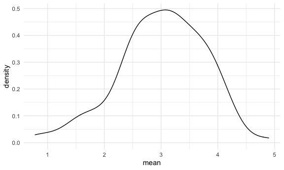
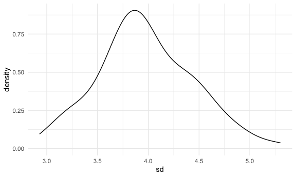

Simulation
================

## Let’s simulate something

``` r
sim_mean_sd = function(samp_size, mu = 3, sigma = 4) { #default true mean and sd
  
  sim_data =
    tibble(
     x = rnorm(n = samp_size, mean = mu, sd = sigma)
    )
  
  sim_data %>%
    summarize(
      mean = mean(x),
      sd = sd(x)
  )
  
}
```

I can “simulate” by running this line.

``` r
sim_mean_sd(30)
```

    ## # A tibble: 1 x 2
    ##    mean    sd
    ##   <dbl> <dbl>
    ## 1  2.00  3.80

## Let’s simulate a lot

Let’s start with a for loop.

``` r
output = vector("list", length = 100)

for (i in 1:100) {
  
  output[[i]] = sim_mean_sd(samp_size = 30)
  
}

bind_rows(output)
```

    ## # A tibble: 100 x 2
    ##     mean    sd
    ##    <dbl> <dbl>
    ##  1  2.00  3.73
    ##  2  3.71  4.54
    ##  3  3.12  3.62
    ##  4  4.16  3.02
    ##  5  3.12  4.29
    ##  6  2.79  3.76
    ##  7  2.21  4.96
    ##  8  3.15  4.22
    ##  9  3.92  3.35
    ## 10  3.92  4.20
    ## # … with 90 more rows

Let’s use a loop function

``` r
sim_results =
  rerun(100, sim_mean_sd(samp_size = 30)) %>%
  bind_rows()
```

let’s look at results …

``` r
sim_results %>%
  ggplot(aes(x = mean)) + geom_density()
```



``` r
sim_results %>%
  summarize(
    avg_samp_mean = mean(mean),
    sd_samp_mean = sd(mean)
  )
```

    ## # A tibble: 1 x 2
    ##   avg_samp_mean sd_samp_mean
    ##           <dbl>        <dbl>
    ## 1          2.81        0.729

``` r
sim_results %>%
  ggplot(aes(x = sd)) + geom_density()
```


